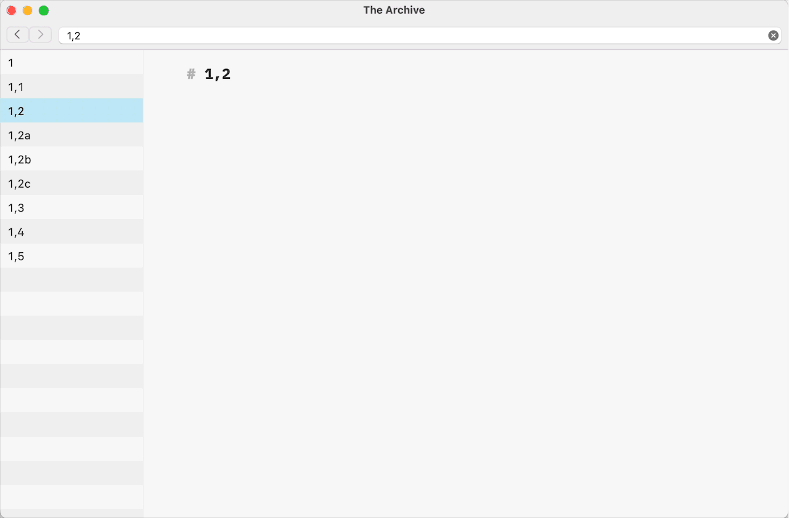

# The New Note
This is one of two plugins for [The Archive](https://zettelkasten.de/the-archive/) that automate the folgezettel naming convention.

The New Note plugin produces a note within the current sequence of notes.

The plugin looks for the Folgezettel ID in the filename, extracts it, and creates a new note with the filename based on the current note, selected in The Archive.

## Plugin Demonstration

## Installation of the Plugin

1. Download a zip file on the [release page](https://github.com/faultseeker/new_note/releases/).
2. Unzip it.
3. Double-click on the .thearchiveplugin bundle to install the plugin.
